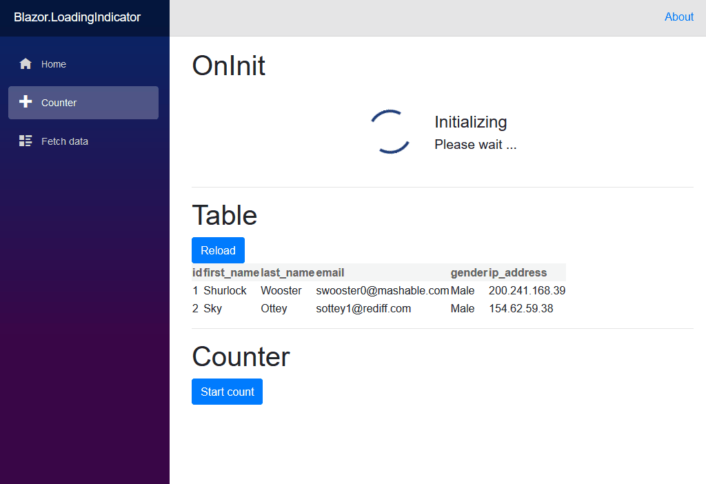

<h1 align="center">Blazor.LoadingIndicator</h1>

Simple to use loading indicator for Microsoft ASP.NET Core Blazor

  

<h2 align="center">Demo</h2>

<h2 align="center">Why I created this</h2>
Sometimes you need to retrieve data from a (slow) server, or sort a huge amount of data. Of course you can just show nothing while loading, or build something yourself that shows a some sort of spinner while the work is being done.

However, copying the same pieces of code to several pages and sometimes to multiple widgets on one page kept annoying me. Thus I decided to create this library to make it a little more easy.

<h2 align="center">How to use</h2>
Take a look at the code of the two sample projects.

The simple example utilizes the built-in template while the more complex example shows how to use multiple templates (even on one page).

<h2 align="center">License</h2>
This library is released under the GNU GPLv3 license.
